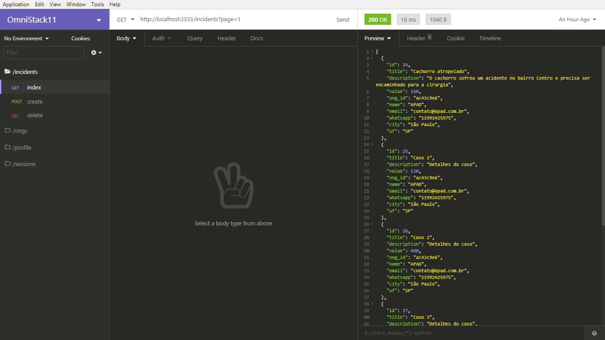
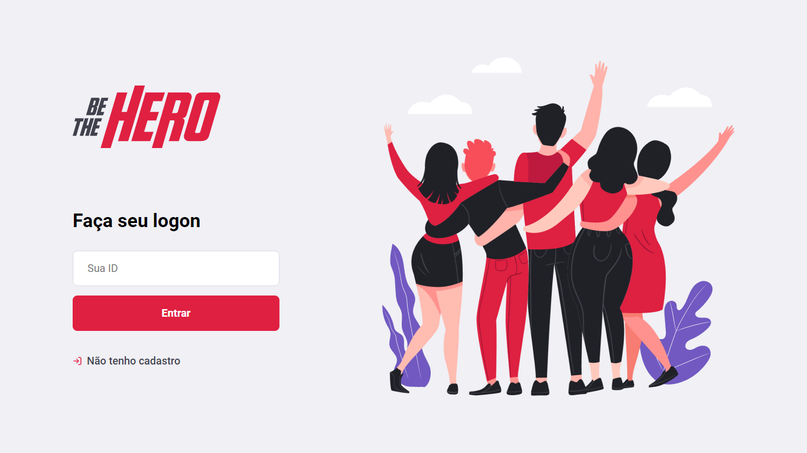
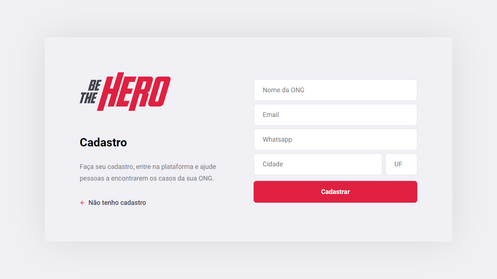
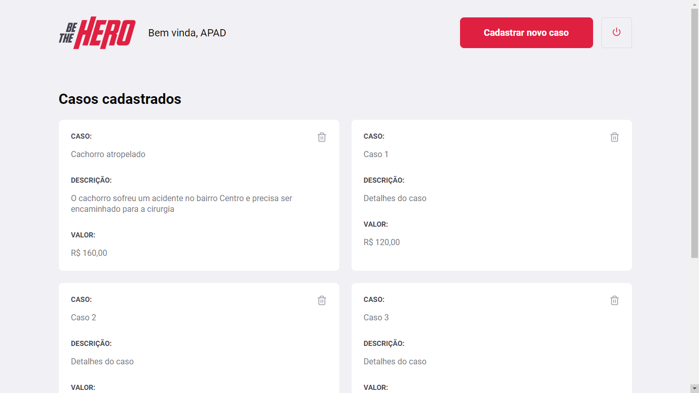
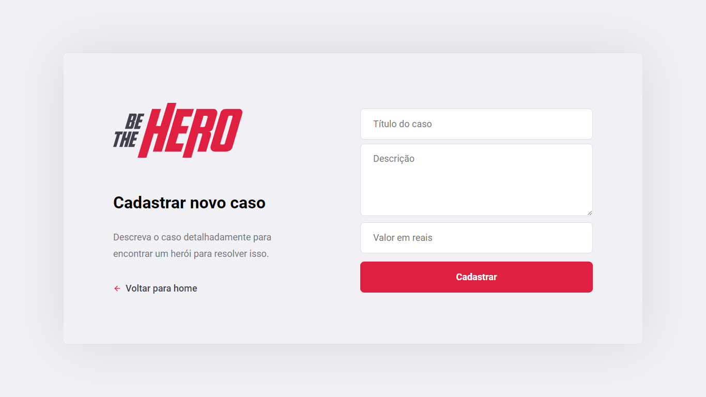
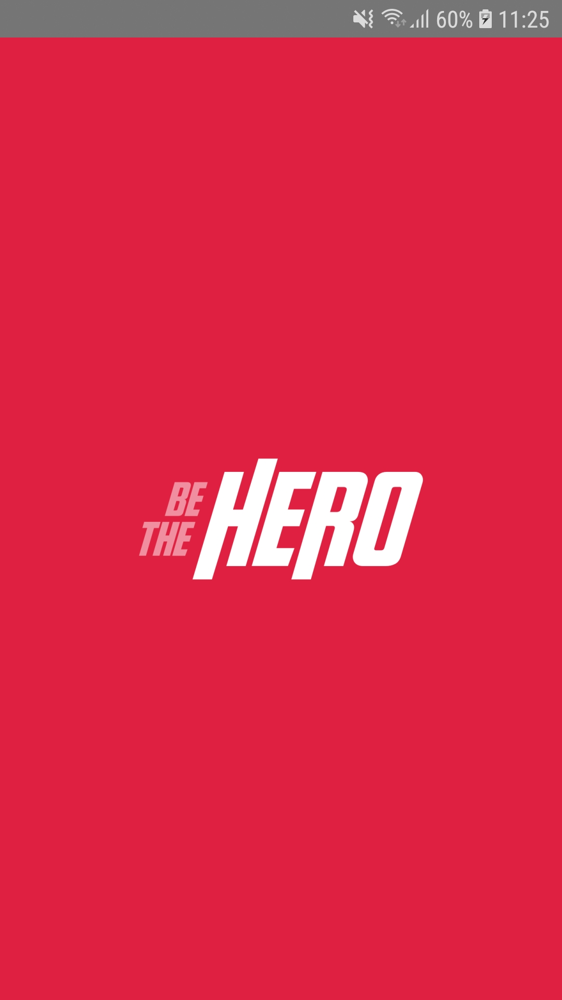
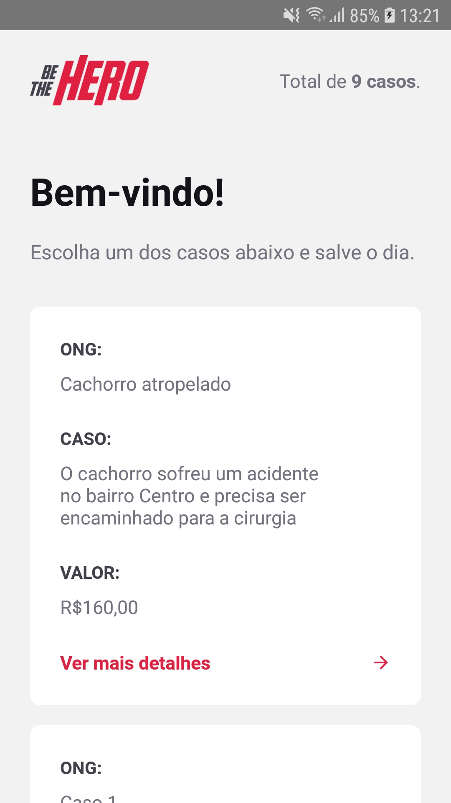

<h1 align="center">Semana Omnistack 11</h1>

Projeto desenvolvido na semana OmniStack 11.0 da Rocketseat.

## Sobre o projeto

A ideia do projeto é construir uma aplicação para cadastro de ONG's para elas poderem cadastrar acidentes que aconteceram com animais e as pessoas possam contribuir para a ajuda desse animal.

## Backend

Para executar o backend siga as instruções do arquivo [README.md](https://github.com/DouglasVarollo/OmniStack11/blob/master/backend/README.md) que está na pasta backend.

  

## Frontend

Para executar o frontend siga as instruções do arquivo [README.md](https://github.com/DouglasVarollo/OmniStack11/blob/master/frontend/README.md) que está na pasta frontend.

  

  

  

  

## Mobile

Para executar o mobile siga as instruções do arquivo [README.md](https://github.com/DouglasVarollo/OmniStack11/blob/master/mobile/README.md) que está na pasta mobile.

  
  

